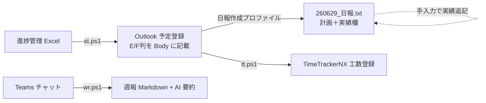

# Dankomi Outlook 日報・段取り自動化スイート

Outlook カレンダーと進捗管理 Excel を中心に、**日報生成・タスク段取り・工数登録・週報作成**を自動化する PowerShell + Python ツール群。

毎日のルーティン（段取り → 実績入力 → 日報 → 工数登録 → 週報）を 4 本のワンコマンドで完結させる。

---

## 目次

- [1. 全体像（1日の流れ）](#1-全体像1日の流れ)
- [2. ツール早見表](#2-ツール早見表)
- [3. セットアップ（初回のみ）](#3-セットアップ初回のみ)
- [4. 日報自動生成](#4-日報自動生成)
- [5. スケジュール段取り（st.ps1）](#5-スケジュール段取りstps1)
- [6. 工数登録（tt.ps1）](#6-工数登録ttps1)
- [7. 週報生成（wr.ps1）](#7-週報生成wrps1)
- [8. ファイル構成](#8-ファイル構成)
- [9. Git 管理ポリシー](#9-git-管理ポリシー)
- [10. トラブルシューティング](#10-トラブルシューティング)

---

## 1. 全体像（1日の流れ）



| 時間帯 | 作業 | コマンド |
|---|---|---|
| 週初め | Excel タスクを Outlook に段取り | `.\st.ps1 -Execute` |
| 朝 | 本日の日報を生成 | ターミナル「日報作成」プロファイル |
| 日中 | 日報に実績を追記 | 手入力 |
| 夕方 | 工数を TimeTracker に登録 | `.\tt.ps1` |
| 週末 | Teams から週報生成 | `.\wr.ps1 -Summarize` |

---

## 2. ツール早見表

| スクリプト | 用途 | 代表コマンド |
|---|---|---|
| 日報生成 | Outlook 予定 → 日報 txt（計画＋実績） | 「日報作成」プロファイル / `python tools/nippo/outlook_auto_nippo.py 260629` |
| `st.ps1` | Excel タスク → Outlook 段取り登録 | `.\st.ps1` / `.\st.ps1 -Execute` / `.\st.ps1 -Clear -Execute` / `.\st.ps1 -Web` |
| `tt.ps1` | Outlook → TimeTrackerNX 工数登録 | `.\tt.ps1` / `.\tt.ps1 260624 -Dry` |
| `wr.ps1` | Teams チャット → 週報 + AI 要約 | `.\wr.ps1 -Summarize` / `.\wr.ps1 -Prompt` |

---

## 3. セットアップ（初回のみ）

### 動作環境

- Windows 10/11
- Python 3.10+
- Outlook（デスクトップ版）
- TimeTrackerNX アカウント・API キー

### インストール

```powershell
python -m venv .venv
.\.venv\Scripts\Activate.ps1
pip install -r requirements.txt
# pywin32 の後処理（必須）
python .venv\Scripts\pywin32_postinstall.py -install
```

### API キーファイル作成

`tt_apikey.txt` を作成し、1 行目に TimeTrackerNX の API キーを記入（**Git 管理外**）。

```
e03bc76e-xxxx-xxxx-xxxx-xxxxxxxxxxxx
```

---

## 4. 日報自動生成

Outlook カレンダーの本日予定を読み取り、`日報/20YY/yymmdd_日報.txt` を自動生成する。
`st.ps1` で登録した予定は Body に Excel の **E 列・F 列情報** が含まれ、日報の `＜業務実績＞` 欄へ自動転記される。

**スクリプト:** `tools/nippo/outlook_auto_nippo.py`

### 通常の使い方（VS Code ターミナルプロファイル）

1. ターミナルパネルの **「+」右横の ▼ ドロップダウン** をクリック
2. **「日報作成」** を選択 → 本日日付で自動生成

> ⚠️ **「+」ボタン直接クリックでは生成されない。** 必ず ▼ から「日報作成」を選ぶこと。

### 手動での作成・再生成

```powershell
.\.venv\Scripts\Activate.ps1
python tools/nippo/outlook_auto_nippo.py 260629        # 日付指定
python tools/nippo/outlook_auto_nippo.py 260629 noempty # 空白スロット省略
```

- **1 日 1 回縛りなし** — 既存ファイルは `_bak_HHMMSS.txt` にバックアップして再生成
- 削除しても同じコマンドで再作成可能

### 出力フォーマット

```
260629_日報
＜特記事項＞
＜業務計画＞
10:00   ＜タスク名＞
＜業務実績＞
10:00   ＜タスク名＞
        【E】対象/ステータス
        【内容】詳細...
        ・
```

---

## 5. スケジュール段取り（st.ps1）

進捗管理 Excel の担当タスク（D列=小林, H列≠済, I列=工数）を読み取り、今週の空き時間へ自動配置する。
Outlook 予定の Body に `[auto-sched]` マーカー + E列/F列情報を記載するため、日報へ自動転記される。

```powershell
.\st.ps1                 # 今週分プレビュー（dry-run）
.\st.ps1 260623          # 週指定（YYMMDD）プレビュー
.\st.ps1 -Execute        # Outlook へ登録
.\st.ps1 -Clear          # 自動登録分の削除プレビュー
.\st.ps1 -Clear -Execute # 自動登録分を削除して再段取り
```

- 優先度 ◎ > ○ > ● 順に配置。◎ は全量確保できなければスキップ
- 「フォーカス時間」は空き枠として再利用

### データ取得元をWeb化システム（manage_exp_progress）に切り替える

Excelを直接読む代わりに、[露出制御業務進捗管理](manage_exp_progress/) (Web化システム) の
`data/tasks.json` を読み込むモードもある。`-Web` を付けるだけでよい。

```powershell
.\st.ps1 -Web            # tasks.json から今週分プレビュー（dry-run）
.\st.ps1 -Web -Execute   # tasks.json から Outlook へ登録
.\st.ps1 -Web 260623 -Execute
```

- Flaskサーバー（`python server.py`）が起動している必要はない。`manage_exp_progress\app\data\tasks.json`
  を直接読み込むだけなので、サーバー停止中でも動作する。
- 抽出条件・スケジューリングロジックはExcel版と同じ（担当者に「小林」を含む・状況が空欄/済以外・
  工数>0の案件）。
- 段取り(plan)・直近の動き(recent)欄はHTML(リッチテキスト)からプレーンテキストへ自動変換される。
  画像を貼り付けている場合、``タグごと除去され本文には影響しない。

---

## 6. 工数登録（tt.ps1）

Outlook 予定または日報を読み取り、TimeTrackerNX に実績を登録する。

```powershell
.\tt.ps1                 # 本日分（Outlook ソース）
.\tt.ps1 260624          # 日付指定
.\tt.ps1 260624 -Dry     # 確認のみ
.\tt.ps1 260624 -Diary   # 日報ファイルから登録
```

重複エラー時は削除して再登録: `python output\tt_delete_date.py 2026-06-24`
詳細は `timetracker_manual.html` を参照。

---

## 7. 週報生成（wr.ps1）

直近 N 日間の Teams チャットから自分の発信/メンションを収集し、週報 Markdown + AI 要約を生成。

```powershell
.\wr.ps1                          # 直近7日（チャットのみ）
.\wr.ps1 -Summarize               # AI 要約まで
.\wr.ps1 -Days 14 -Summarize      # 14日分
.\wr.ps1 -Channels -TeamsAllow "BEV,FCM,DCAP"  # Teams チャンネルも
.\wr.ps1 -Prompt                  # 手動貼り付け用プロンプト
.\wr.ps1 -Auth                    # トークン再認証
```

初回のみ GitHub Models API キー保存: `.\wr.ps1 -ApiKey "ghp_xxx" -SaveKey -Summarize`
出力: `output\weekly_report_YYYYMMDD_HHMM.md`

### 業務進捗表連携（任意）

`-Summarize` / `-Prompt` 実行時に自分の業務進捗Excelを一緒に読み込み、AI要約に現在の進捗を反映させたり、
更新案を提案させたりできる。デフォルトでは何も設定されず、この機能は単に無効になるだけ（エラーにはならない）。

```powershell
# 毎回指定する場合
.\wr.ps1 -Summarize -TaskOwner "自分の名字" -TaskExcel "C:\path\to\進捗.xlsx"

# 毎回指定しなくてもよいようにする場合
# 1) tools\.user_config.example.json を tools\.user_config.json にコピー
# 2) task_owner / task_excel_path を自分の値に書き換え（このファイルは Git 管理外）
# もしくは担当者名だけをコマンドで保存:
.\wr.ps1 -TaskOwner "自分の名字" -SaveTaskOwner -Prompt
```

---

## 8. ファイル構成

| ファイル | 役割 |
|---|---|
| `tools/nippo/outlook_auto_nippo.py` | 日報生成メイン |
| `schedule_tasks.py` / `st.ps1` | タスク段取り |
| `timetracker_register.py` / `tt.ps1` | 工数登録 |
| `timetracker_config.json` | プロジェクト・WorkItem 設定 |
| `timetracker_manual.html` | 工数登録マニュアル |
| `tools/teams_weekly_report.py` / `wr.ps1` | 週報生成 |
| `.vscode/settings.json` | 「日報作成」ターミナルプロファイル定義 |
| `requirements.txt` | Python 依存 |
| `tt_apikey.txt` | **自分で作成・Git 管理外** |

---

## 9. Git 管理ポリシー

`.gitignore` は**ホワイトリスト方式**（全無視 → 必要ファイルのみ追跡）。日報・議事メモ・個人ログは追跡しない。

**管理対象:** README / requirements / 4ツール本体 / config / プロファイル設定
**管理外:** `tt_apikey.txt`・各種トークン（`tools/.gh_models_token`・`tools/.msal_token_cache.json`等）・
`tools/.user_config.json`（wr.ps1の個人設定）・`tools/.teams_allow`・`.venv/`・日報/議事メモ等業務データ

---

## 10. トラブルシューティング

| 症状 | 原因 | 対処 |
|---|---|---|
| 「+」で日報が生成されない | 既定 PowerShell が開くだけ | ▼ →「日報作成」を選択 |
| 工数登録で重複エラー | 既登録あり | `python output\tt_delete_date.py 日付` で削除後再実行 |
| 週報でトークン切れ | MSAL 期限切れ | `.\wr.ps1 -Auth` で再認証 |
| `tt_apikey.txt 不在` | キー未作成 | ファイル作成し API キー記入 |
